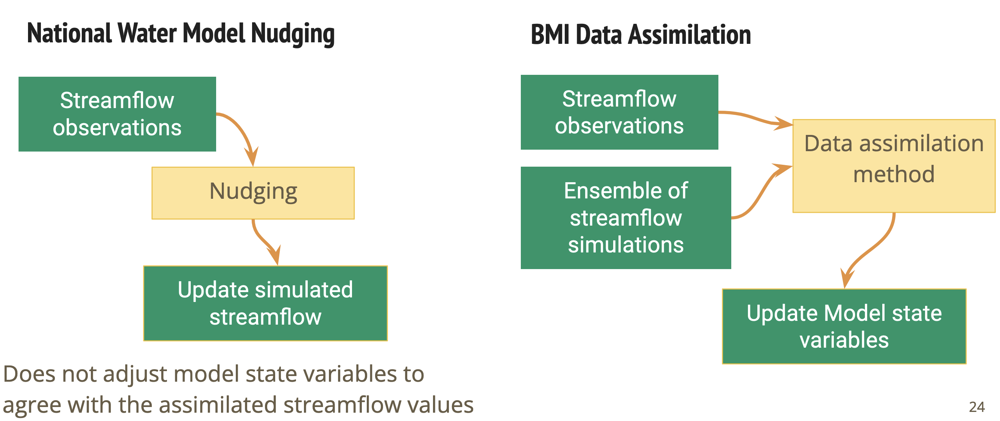
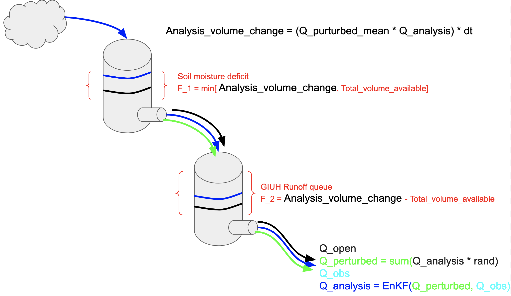
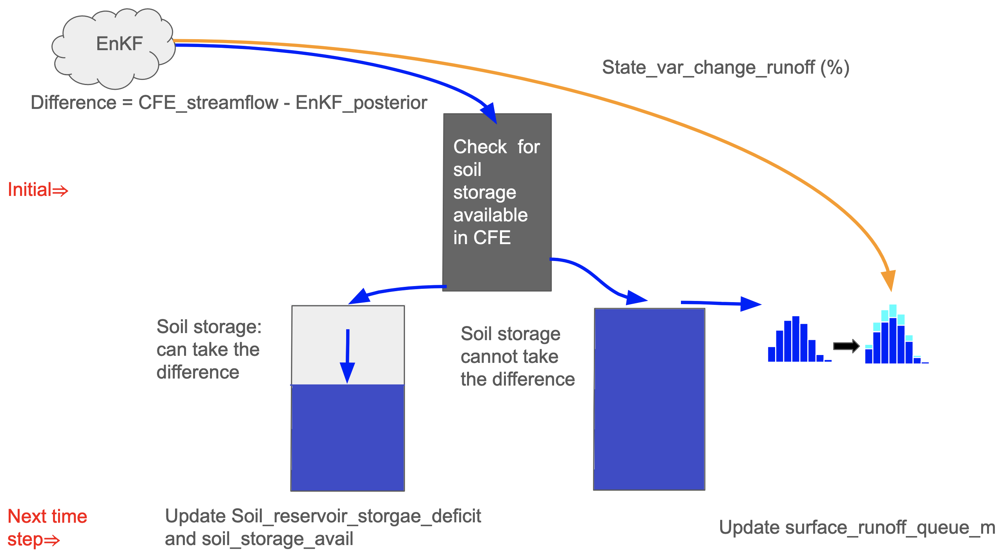
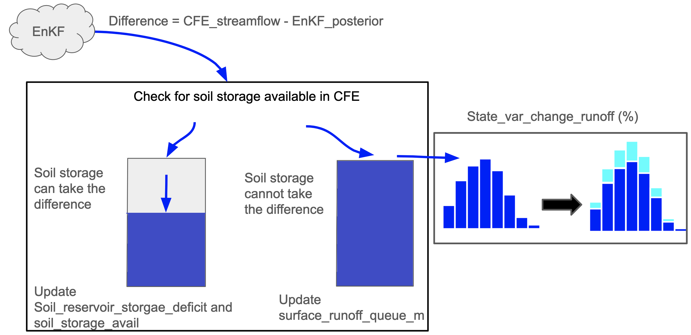

# Data Assimilation for Nextgen with BMI

This repository contains two methods of data assimilation currently under development with potential applications for the Nextgen Water Modeling Framework Prototype ([https://github.com/NOAA-OWP/ngen](https://github.com/NOAA-OWP/ngen)).

- Data assimilation for the Conceptual Functional Equivalent model (CFE; [https://github.com/NOAA-OWP/cfe](https://github.com/NOAA-OWP/cfe)). This method uses observed streamflow values to update the states of CFE, which improves the rainfall-runoff estimate from the hydrofabric catchments. This method has been developed by groups during the 2022 and 2023 Summer Institute.
- Data assimilation for the routing network. This method updates the streamflow across the entire network of routing links. This method has been developed by the 2023 Summer Institue.

## Installation

There are two main notebooks to run the DA methods.
- `DA-Routing/carmel_muskingum_cunge.ipynb`
- `example_run_da_CFE/my_run.ipynb`

## Dependencies

There are quite a few libraries that you'll need to install, and you can do so with the command: `pip install -r requirements.txt`

## Installation

Detailed instructions on how to install, configure, and get the project running.
This should be frequently tested to ensure reliability. Alternatively, link to
a separate [INSTALL](INSTALL.md) document.

## Usage

There will be a notebook which demonstrates how to run the code outside of the Nextgen Framework.  
There will be some code explaining how to run this within the Nextgen Framework

## How to test the software

If the software will include automated tests.

## Known issues

* Not exactly sure where to host code for different models/modules that will be used in the examples.
* CFE data assimilation is not quite stable, need to work out some sensitivity issues.

## Getting help

If you have questions, concerns, bug reports, etc, please file an issue in this repository's Issue Tracker.

## Getting involved

Please see our contribution instructions [CONTRIBUTING](CONTRIBUTING.md).

----

## Open source licensing info
1. [TERMS](TERMS.md)
2. [LICENSE](LICENSE)

----

## Credits and references

* Timilsina et al. 2023. “Data Assimilation in the Nextgen Framework for Improved Streamflow Predictions”. Upcoming 2023 AGU Fall Meeting.
* Foroumandi et al., 2023. “Development of an Ensemble Hydrologic Data Assimilation within NextGen Framework”. Upcoming 2023 AGU Fall Meeting.
* Deardorff E., A. Modaresi Rad, et al. (2022). National Water Center Innovators Program - Summer Institute, CUAHSI Technical Report, HydroShare, http://www.hydroshare.org/resource/096e7badabb44c9f8c29751098f83afa
* Wolkeba F. T., K. O. Ekpetere, M. S. Abualqumboz , and Z. J. Butler (2022). Data assimilation of USGS streamflow in the Nextgen Framework
* Abualqumboz et al. 2022. “Data Assimilation of USGS Streamflow Data in the Nextgen Framework”. AGU Fall Meeting

# Some old figures

This figure describes the difference between the naive NWM data assimilation method and this BMI-based general data assimilation framework.

